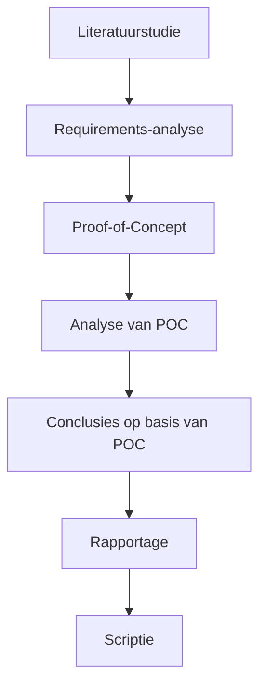

```mermaid
flowchart TD
    A[Literatuurstudie] --> B[Requirements-analyse];
    B --> C[Proof-of-Concept];
    C --> D[Analyse van POC];
    D --> E[Conclusies op basis van POC];
    E --> F[Rapportage];
    F --> G[Scriptie];
```